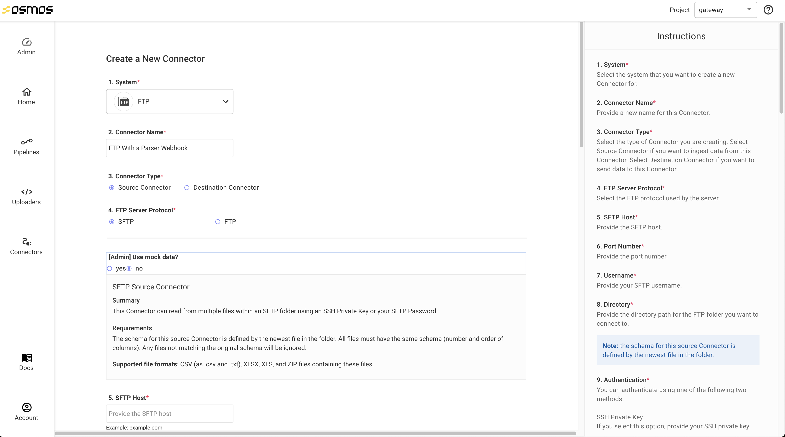
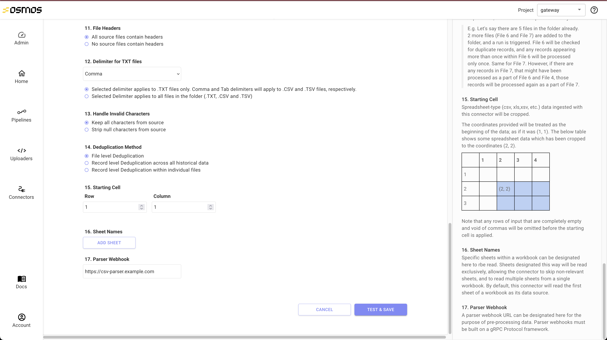

# Osmos Parser Webhook

This example implements a webhook servier that receives the bytes of a file and parses it to return the data inside the file in tabular form.
This code can be modified to add support for arbitrary file types to Osmos (eg: XML, EDI etc.)

## Getting Started

To follow along in this tutorial, we use [grpcurl](https://github.com/fullstorydev/grpcurl) to make gRPC requests from the command line.
To install on macos run

```bash
brew install grpcurl
```

For linux please check out https://repology.org/project/grpcurl/information and find the correct package manager for your system.

To install from the source code please run

```bash
go install github.com/fullstorydev/grpcurl/cmd/grpcurl@latest
```

If these methods fail please check the [grpcurl install instructions](https://github.com/fullstorydev/grpcurl#installation)

Before getting started, please ensure you have NodeJS installed onto your local machine.

Next, let's install our dependencies by running

```bash
npm install
```

## gRPC protos

The requests Osmos will make to your service are defined in `protos/parser.proto`. Please take a look at this file to understand the shape of the request

## Up and running

To start our server run

```bash
npm run start
```

This will start the server which is listening on port `50051`

## An example request

Next, let's go ahead and make a request to the server. Our request is going to read in the contents of `serious_business.txt` as bytes and forward those as a grpc request to the server. To do so run

```bash
grpcurl -import-path ./protos -proto parser.proto -plaintext -d "{\"file_name\": \"serious_business.txt\", \"data\": \"$(cat serious_business.txt | base64)\" }" localhost:50051 osmos.parser.v1.Parser/ParseFileToTable
```

Please note that the `data` attribute must be base64 encoded when using the JSON format for gRPC (see [here](https://developers.google.com/protocol-buffers/docs/proto3#json) for more information)

We should see an output that looks something like this

```json
{
  "headers": ["name", "email", "food"],
  "rows": [
    {
      "values": ["josh", "coolbeans@gmail.com", "pizza"]
    },
    {
      "values": ["jane", "recycling@gmail.com", "hamburger"]
    },
    {
      "values": ["richard", "iloveclouds@gmail.com", "fries"]
    }
  ]
}
```

## Integrating with Osmos

Once your service is up and deployed, please ask Osmos support to enable the ability for your org to use parser webhooks. [support@osmos.io](mailto:support@osmos.io).

> :warning: If this feature is not enabled, you will not see anything in the UI for adding your parser webhook URL :warning:

Let's go ahead and create a new connector by clicking on the `Connectors` button on the left side of your screen followed by the `New Connector` button.

Next, let's select our connector type (FTP in this example), give it a name and set the `Connector Type` to `Source Connector`.



Next we will fill out any relevant data to our connector (authorization, schema, etc.) as we normally would.

Finally, at the bottom, let's add our parser webhook URL



Finally, click `Test & Save`. Once everything checks out you are all set to go!

## Next Steps

From here, you should be able to add/remove/change any of the proto files and update the endpoints to your needs.
If you need any help please contact [support@osmos.io](mailto:support@osmos.io).
